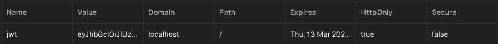

# Propuesta
Este proyecto que realizare, sera un ejemplo de simulacion de messenger o whatsapp, estare usando unica y exclusivamente herramientas de desarrollo para JS, esto en un enfoque de desarrollo MERN.

### Proposito
Conocer mas librerias para el desarrollo backend, asi como una forma segura de autenticacion e interaccion en tiempo real con otros usuarios

## Primer avance
En esta parte de forma muy sencilla y basica me encargue de crear la parte de enrutamiento y los controladores para la autenticacion, solamente eso. De igual forma para el front creamos el proyecto con vite y no le he movido nada

### Otro avance del dia 05/05/2025
Primero me encargue de la conexion de la base de datos utilizando MongoDB y Mongoose, de igual forma cree el esquema del primer modelo que es el usuario.
Tambien otro punto importante a resaltar es el avance dentro del controlador de CREAR CUENTA, ya que de aqui aprendi a generar un JWT y de paso a hashear passwords con una sal y con la libreria de bcryptjs.
Lo que cabe a destacar aqui es la creacion de la cookie con JWT que a posterior nos va a generar una seguridad para saber que usuario esta autenticado y cual no

## Segundo avance
En esta parte me encargue de la logica del backend para el login, logout, actualizacion de la foto de perfil y un verificador para cuando se resetee la pagina se mantenga la sesion con la cookie.
Para el login lo que buscamos es que el usuario exista, y en caso de existir confirmar si la contraseña es correcta, para esto usamos el metodo compare de bycript, comparando la contraseña ingresada con la guardada haseada en mongo.
El logout es sencillo ya que tenemos que hacer expirar la cookie de forma inmediata.
Para actualizar la foto de perfil aqui se hacen pasos de mas, puesto que necesitmos una correcta autenticacion. Por ello en las rutas pasaremos 3 parametros, donde protectRoute será el middleware que permitira reconocer o no el token obtenido, si pasa todas las verificaciones, entonces lo manda a la funcion que permite usar la API de cloudinary para guardar la imagen en la nube y dejar el link en nuestro mongoDB.
Y para el check cada vez que se refresque la pagina solo va a buscar si tiene el token o no para mantener la sesion activa