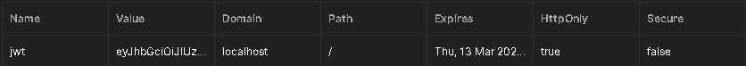
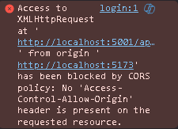

# Propuesta
Este proyecto que realizare, sera un ejemplo de simulacion de messenger o whatsapp, estare usando unica y exclusivamente herramientas de desarrollo para JS, esto en un enfoque de desarrollo MERN.

### Proposito
Conocer mas librerias para el desarrollo backend, asi como una forma segura de autenticacion e interaccion en tiempo real con otros usuarios

## Primer avance
En esta parte de forma muy sencilla y basica me encargue de crear la parte de enrutamiento y los controladores para la autenticacion, solamente eso. De igual forma para el front creamos el proyecto con vite y no le he movido nada

### Otro avance del dia 05/05/2025
Primero me encargue de la conexion de la base de datos utilizando MongoDB y Mongoose, de igual forma cree el esquema del primer modelo que es el usuario.
Tambien otro punto importante a resaltar es el avance dentro del controlador de CREAR CUENTA, ya que de aqui aprendi a generar un JWT y de paso a hashear passwords con una sal y con la libreria de bcryptjs.
Lo que cabe a destacar aqui es la creacion de la cookie con JWT que a posterior nos va a generar una seguridad para saber que usuario esta autenticado y cual no

## Segundo avance
En esta parte me encargue de la logica del backend para el login, logout, actualizacion de la foto de perfil y un verificador para cuando se resetee la pagina se mantenga la sesion con la cookie.
Para el login lo que buscamos es que el usuario exista, y en caso de existir confirmar si la contraseña es correcta, para esto usamos el metodo compare de bycript, comparando la contraseña ingresada con la guardada haseada en mongo.
El logout es sencillo ya que tenemos que hacer expirar la cookie de forma inmediata.
Para actualizar la foto de perfil aqui se hacen pasos de mas, puesto que necesitmos una correcta autenticacion. Por ello en las rutas pasaremos 3 parametros, donde protectRoute será el middleware que permitira reconocer o no el token obtenido, si pasa todas las verificaciones, entonces lo manda a la funcion que permite usar la API de cloudinary para guardar la imagen en la nube y dejar el link en nuestro mongoDB.
Y para el check cada vez que se refresque la pagina solo va a buscar si tiene el token o no para mantener la sesion activa

## Tercer avance
En este avance me dedique unica y enteramente a la creacion del modelo para mensajes, el enrutamiento de los endpoints y de las funciones que se van a hacer dentro del controlador.
Basicamente mostrar a todos los usuarios excepto a mi, cargar todos los mensajes de un usuario en especifico que ha tenido con mi usuario y finalmente mandar mensajes a un nuevo usuario.
Lo unico diferente es la sintaxis que hay sobre el $or de Mongo para cargar ya sea mis mensajes o los mensajes del otro. Tambien que usamos cloudinary en caso de que al mandar un nuevo mensaje este sea una imagen.
#### TODO
        De momento he dejado las funcionalidades de la creacion del mensaje tal cual asi en su creacion y ya. Pero falta implementacion de tiempo real, por lo que en un futuro estare usando socket.io

## Cuarto avance
Implementacion de daisyUI, y routing en react.
De igual forma se creo una implementacion de seguridad con el verificador isChecked que hicimos en el backend, esto con el fin de guardarlo en un estado global con zustand y permita navegar libremente por las demas rutas en caso de tener un token autorizado, caso contrario solo tendra acceso a la parte de iniciar sesion y crear usuario.
En el estado global existen 4 "atributos" y un metodo, este metodo lo que se encarga es la parte de la autenticacion con axios dirigiendose al endpoint del backend /auth/check, con el fin de establecer si el usuario esta autenticado desde un inicio o no. Pero aqui hay una cosa a aclarar, de momento como no hemos convergido el front con el back, tenemos que hacer uso de una libreria para lograr estos resultados, esto se da mediante cors, en donde le pasaremos la ruta del origen de la URL de react y le decimos que existen credenciales, en nuestro caso son los Tokens y los headers.

## Quinto avance
En este dia me enfoque al desarrollo frontend de crear cuenta en la aplicacion, no cabe mucho que resaltar mas que hacer una validacion para ver si los datos ingresados son correctos, dar notificaciones con toast, cambiar el estado global para poder iniciar sesion al mandar el formulario los campos correspondientes.
De paso implemente el salir de la sesion en el estado golbarl unicamente usando una instancia de axios al endpoint correspondiente.

## Sexto avance
En este dia segui en la parte del frontend para el navbar, en esta tendra un conditional rendering en el que si existe un usuario saldran mas botones para salir de sesion y personalizar el perfil, en caso de no estar autenticado solo tendra las opciones de cnfiguracion general de la APP (color del tema).
Hice el forntend de la parte de login, aqui es casi exactamente igual que la parte de signup. De paso corregi los errores del quinto avance que eran relacionados a los iconos, lo que pasaba era la superposicion de elementos entre absolute y relative, ya que los iconos se empalmaban por ser cargados primero, asi que le asigne un z-index mayor.

De igual forma seguimos en la parte del frontend, pero en esta ocasion me enfoque en la parte del editar perfil del usuario. Codigo un tanto repetitivo, ya que como manejamos procesos asincronos establecemos configuraciones en el UI para ver el circulo de carga o que el boton no se pueda seleccionar. Lo unico interesante a resaltar es la parte del formulario en que subimos una imagen y el evento que dispara en el que hacemos uso del FileReader para leer la informacion como url y pasar la imagen a un formato de 64, ponemos la imagen para actualizar el UI, actualizamos el link de la imagen en mongo y finalmente o mejor dicho antes del mongo, guardar la imagen en el bucket que tenemos en cloudinary.

### Nota importante
Las versiones de tailwindCSS v4 y v3 son totalmente distintas, ahora ya no se hace nada en el config.js, puesto que todo puede ser asignado a una hoja de estilo. Pero seguiremos usando la v3 ya que es con la que sigo aprendiendo.

## Septimo avance
En este dia me encargue de hacer el UI de la parte de configuraciones de la pagina, esto con el motivo de cargar todos los estilos con los que cuenta daisyUI, por eso puse la nota anterior.
Para lograr guardar los estilos creamos un contexto global con zustand para guardarlos. En este estado global sus estados default es el tema que este almacenado en el local storage, en caso de que no, se dispara una funcion para rescatar desde las preferencias del buscador el tema que le gusta al usuario, y si algo falla entra de reserva el tema claro.
Ahora para mandar a llamar todas los temas de DaisyUI tuve que leer la documentacion de la version 3, por lo que solamente en el tailwind.config se agrega daisyui: TEMAS, pero estos temas como son constantes los copie y pegue en un archivo para no tener tanta cosa en el config de tailwind.
Retomando el estado global con Zustand, lo que importa es que para establecer el color debemos pasar un tema y este tema sera guardado en el localStorage y despues aplicamos la renderizacion con un set().
En la parte de react en las configuraciones solo mandamos a importar ese estado global, hacemos un map a todas las constantes que tenemos, le damos formato a un boton por cada constante y cuando se da click dispara la accion del setTheme del tema que estemos clickeando

## octavo avance
Este dia estuve realizando el UI para la parte de lo mas importante que es el de los mensajes. Primero que nada como partimos la app en 2 la parte de la izquierda que va a ser para el listado de usuarios y la parte de la derecha que es el contenedor de mensajes. De momento aun no hacemos la parte del contenedor de chat. Pero debemos tener clara la logica de programacion, para esto necesitaremos crear un nuevo estado global en zustand, para cargar los mensajes entre los perfiles con los que has hablado, toda la lista de usuarios que tenemos en nuestros clusters de mongo, el usuario con el que queramos chatear y las propiedades para hacer un loading en este caso son la carga de usuarios y mensajes.
Todo lo que viene siendo el contexto global, las instancias de axios se van directo a los endpoints establecidos en el backend, asi como lo hicimos para la autenticacion de los usuarios, pero aqui con la ruta de los mensajes.
Toda la carga de mensajes la vamos a manejar en el componente del sidebar esto con el fin de atomizar lo mas posible. Dentro de aqui vamos a tener que usar los estados globales de los mensajes, con el fin de identificar si de este lado debe cargar una plantilla o no esto lo sabremos por las banderas que establecimos, usaremos uso de un use effect para que cuando acabe de hacer el fetching vuelva a renderizar, pero en el proceso mostrar un esqueleto o prototipo de como se van a ver los usuaros, basicamente recuadros flotantes animados.
Actualice el useAuthStore para que facilite en un contexto global todos los usuarios en linea, pero aun queda pendiente esa funcionalidad
Deje pendientes algunas funcionalidades como por ejemplo cargar a los usuarios en linea para que se muestren en el UI con un circulo verde.
Hay un metodo dentro del useChatStore para seleccionar al usuario que lo deje simplemente funcional,pero hace falta algunas cosas mas para su correcto funcionamiento.

## Noveno avance
En este dia me dedique enteramente a desarrollar la parte del contenedor del mensaje, especificamente en el UI para la carga de las imagenes y enviado del mensaje. Aprendi como trabaja el useRef, basicamente es un querySelector para establecer referencias. De igual forma es este componente al hacer un fetching se mostrara un esqueleto de lo que puede llegar a ser la forma en como se ven los mensajes. Cree un header que se va actualizando con la informacion del usuario y todo lo demas lo dedique en la creacion del componente para subir elementos. Ya que tuvimos que crear un metodo dentro de nuestro entorno global useChatStore para poder mandar los mensajes a partir de la informacion recibida a un endpoint que tenemos dentro del backend. Lo unico interesante de aqui es que hicimos uso de un get() para usar los datos dentro del entorno global y no pasarlos como argumentos, de esa forma utilizamos al usuario al cual esta apuntando y los mensajes cargados. Nada mas que para no perder toda la informacion y que solo se muestre el ultimo mensaje enviavo, hicimos una destructuracion de los mensajes, mas la respuesta del endpoint.
Un error que tuve que corregir, sucedio en los modelos, ya que en los mensajes estableci una llave que en los controladores no estaba usando, basicamente escribi Image en el esquema e image en los controladores.